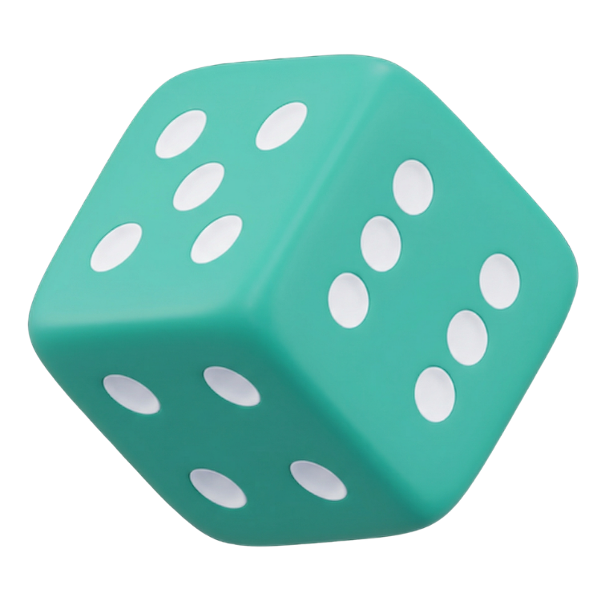

<div align="center">
  
  <h1>LuckyDraw</h1>
  <p>A polished, fast, and fully client-side raffle app — draw names, numbers, teams, letters, spin a wheel, and more.</p>

  [](https://leotaborda.github.io/LuckyDraw/)
  [](LICENSE)
  []
</div>

---

## Features

| Feature | Description |
|---|---|
| Names, Numbers & Items | Draw one or more winners from any list |
| Teams | Split participants into balanced random teams |
| Coin Flip | Heads or tails with a 3D flip animation and session stats |
| Letters | Slot-machine style letter draw |
| Wheel | Spinning prize wheel with elimination mode |
| Random Order | Shuffle a list into a random ranking |
| Surprise Timer | Hidden countdown that reveals when time's up |
| Elimination Mode | Run successive draws until one champion remains |
| Bilingual | Full Portuguese and English support |
| Dark / Light theme | Persisted per user |
| Draw History | Last 50 draws saved locally in the browser |
| Confetti & animations | Countdown overlay, rolling display, card reveals |
| Responsive | Works on desktop, tablet, and mobile |
| Privacy-first | 100% client-side, no server, no tracking |

---

## Getting started

No build step required. Pick any of the options below:

**Option 1 — VS Code Live Server extension**

Install the [Live Server](https://marketplace.visualstudio.com/items?itemName=ritwickdey.LiveServer) extension, then right-click `index.html` in the Explorer and choose **Open with Live Server** (or click **Go Live** in the status bar).

**Option 2 — Python (built-in)**

```bash
python3 -m http.server 4173
```

**Option 3 — Node.js**

```bash
npx serve . -l 4173
```

For options 2 and 3, open **http://localhost:4173** in your browser.

---

## Tech stack

- **Vanilla JavaScript** (ES modules, no frameworks, no bundler)
- **CSS custom properties** for theming
- **localStorage** for persistence
- **Canvas API** for the spinning wheel and confetti

---

## License

MIT © [Leonardo Taborda](https://github.com/leotaborda)
